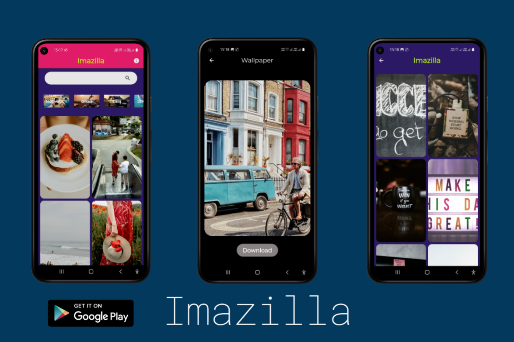
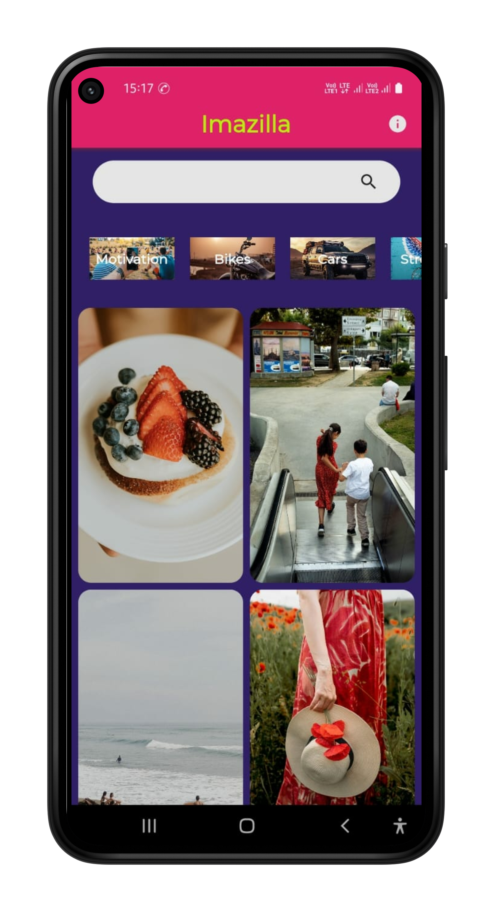
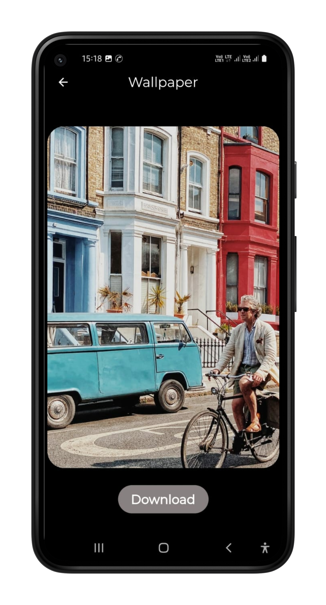
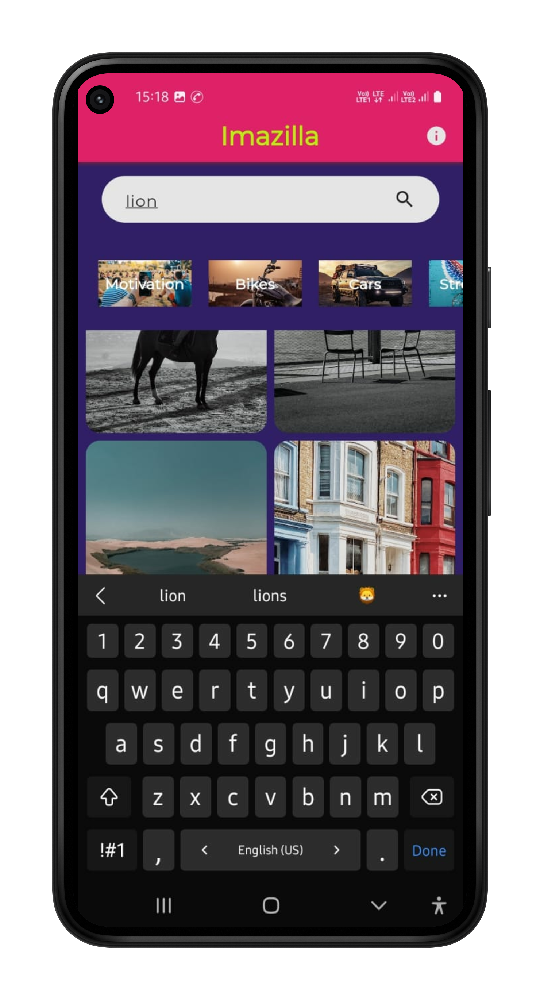
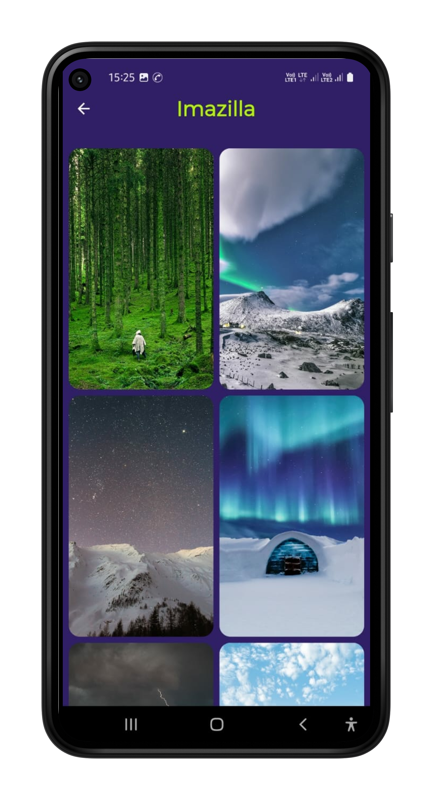
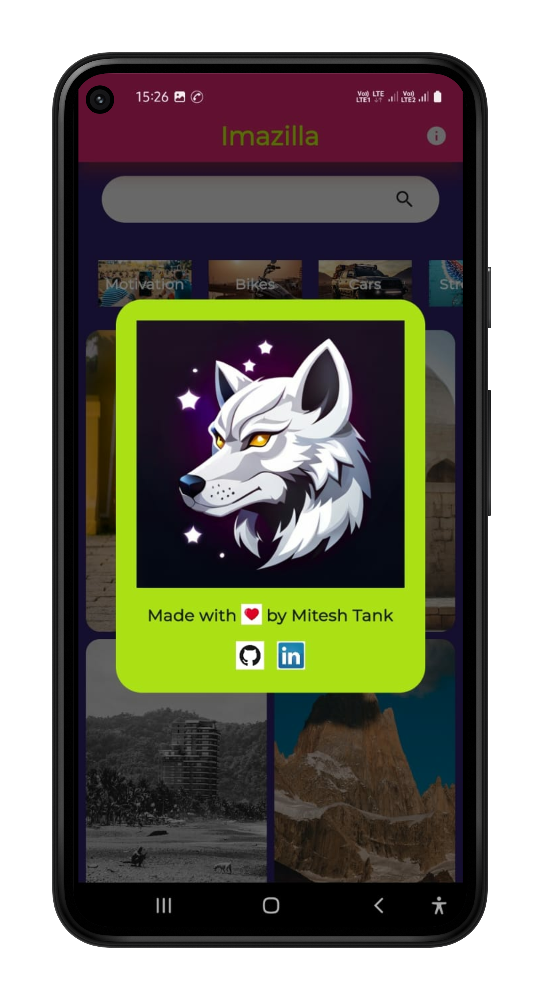

# **Imazilla** 

- App Link: [Click Me!]()
- Demo Video: [Click Me!]()

## Table of contents
- [**Imazilla**](#imazilla)
  - [Table of contents](#table-of-contents)
  - [Learn Flutter](#learn-flutter)
      - [Why Flutter?](#why-flutter)
  - [Need Help / Contribute 🚨](#need-help--contribute-)
  - [Overview](#overview)
  - [My process](#my-process)
    - [What I learned](#what-i-learned)
      - [Dependencies](#dependencies)
    - [Built with](#built-with)
  - [🖥️ Tech Stack](#️-tech-stack)
    - [🚀 Features🔥](#-features)
    - [😇 Upcoming Features🔥](#-upcoming-features)
  - [Sneak Peek 🙈](#sneak-peek-)
  - [Useful resources](#useful-resources)
  - [📬 Contact](#-contact)

## Learn Flutter 

This project is a starting point for a Flutter application. A few resources to get you started if this is your first Flutter project:

- [Lab: Write your first Flutter app](https://flutter.dev/docs/get-started/codelab)
- [Cookbook: Useful Flutter samples](https://flutter.dev/docs/cookbook)

For help getting started with Flutter, view our
[online documentation](https://flutter.dev/docs), which offers tutorials,
samples, guidance on mobile development, and a full API reference.

#### Why Flutter?  
- Flutter offers cross-platform development, allowing you to build mobile apps for both iOS and Android using a single codebase, reducing development time and costs.
- Its hot reload feature enables developers to see changes in real-time, making the development process faster and more efficient.
- Flutter provides a rich set of customizable widgets and a responsive UI framework, enabling developers to create visually stunning and native-like user experiences for their apps.

## Need Help / Contribute 🚨
- We are building an initial release🤞 Our product will be launched very soon✔
- Need More Contributors and maintainers🤝
If intersted kindly contact [Here](#📬-contact)

## Overview

Introducing Imazilla, your ultimate destination for downloading stunning HD wallpapers and images effortlessly. Crafted with love using the versatile Flutter framework, Imazilla offers an unrivaled collection of high-quality visuals, completely free of charge. With an intuitive user interface, browsing through our extensive library is a breeze, allowing you to effortlessly discover and download the perfect wallpaper to personalize your device. Imazilla keeps you ahead of the game by regularly updating its vast repository, ensuring a continuous stream of fresh and captivating content for every taste. Embrace the power of customization with Imazilla and make your device truly shine with breathtaking wallpapers, all within the palm of your hand. Experience a seamless and visually immersive journey with Imazilla today.

## My process

- To enhance my skills in Flutter development, I implemented incremental components of projects to excel in my development abilities.
- **All Links are in [Useful resources](#useful-resources).**

### What I learned
- Exploration of Flutter List and More UI components
- Explored API integration with Flutter and State Management.
- learn about download and store image in phone storage.
- I gained an in-depth comprehension of Flutter and Android architecture, delving into the intricacies and exploring a wide range of cool and practical dependencies.

#### Dependencies

- http: ^0.13.5
- flutter_svg: ^2.0.6
- cached_network_image: ^3.1.0
- flutter_dotenv: ^5.0.2
- flutter_staggered_grid_view: ^0.6.2
- path_provider: ^2.0.14
- fluttertoast: ^8.2.1
- url_launcher: ^6.1.10
- flutter_wallpaper_manager: ^0.0.3

### Built with

- Flutter

## 🖥️ Tech Stack

**Frontend:**

&nbsp;

### 🚀 Features🔥

- Search Any Wallpaper
- Select category filter
- Download HD wallpaper in your phone.

### 😇 Upcoming Features🔥

- More beautiful UI

## Sneak Peek 🙈

<!-- <table>
<th></th>
  <tr>
    <td></td>
    <td></td>
  </tr>
  <tr>
    <td></td>
    <td></td>
  </tr>
  <tr>
    <td></td>
    <td></td>
  </tr>
  <tr>
    <td></td>
    <td></td>
  </tr>
</table> -->
 

 

## Useful resources

- [Flutter & Dart - The Complete Guide [2023 Edition]](https://www.udemy.com/course/learn-flutter-dart-to-build-ios-android-apps/) - This is the Udemy Course that i followed to learn Flutter Development.
- [Codepur](https://www.youtube.com/@HelloCodepur) - This is the Youtube Channel that i followed to learn Flutter In Hindi( Best YT channel for Flutter💙 ).
- Must Try :- [Official Documentation](https://docs.flutter.dev/)
- Also Some Online Blogs and Articles.

## 📬 Contact

If you want to contact me, you can reach me through below handles.

© 2023 Mitesh Tank ❤

